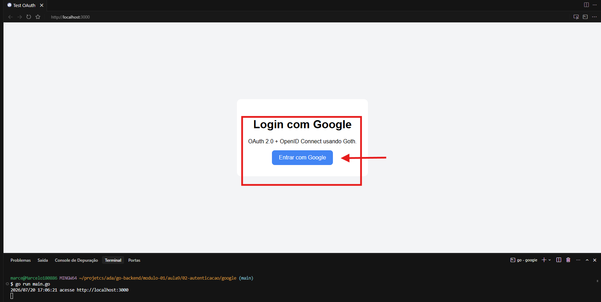
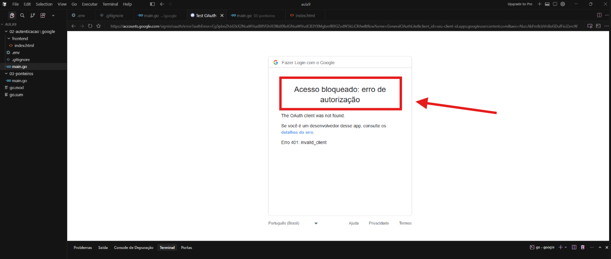
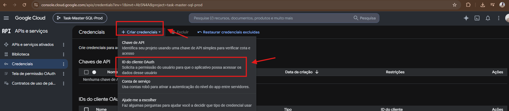
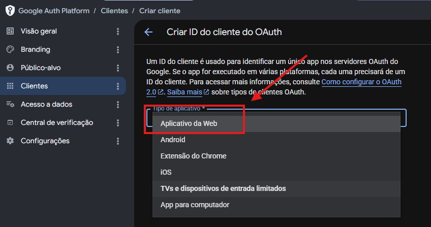
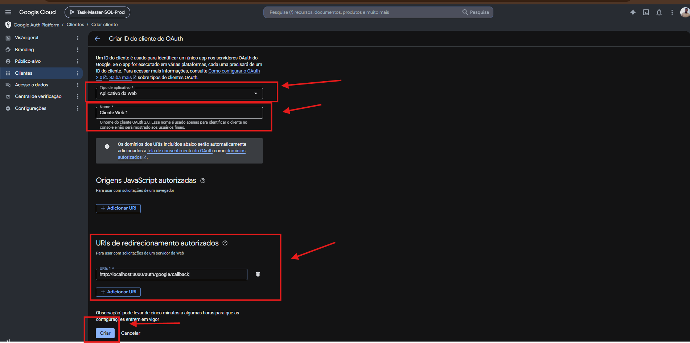
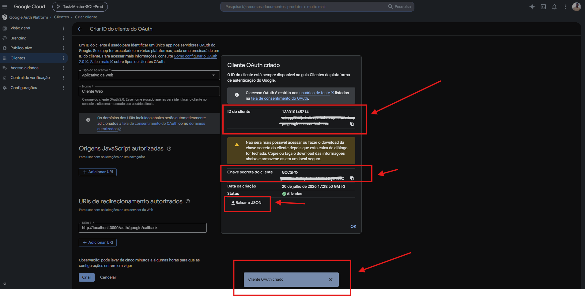
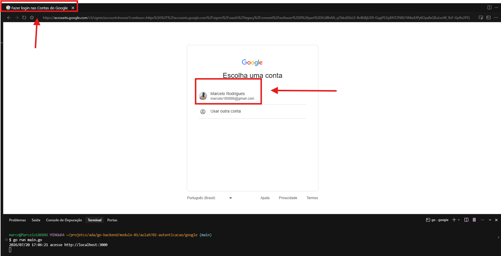
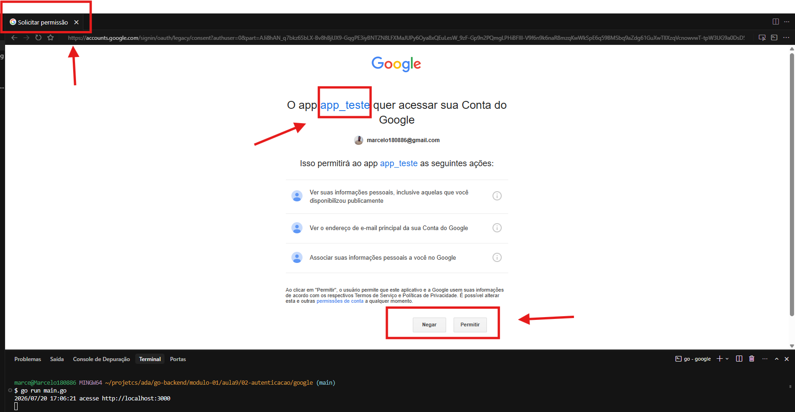
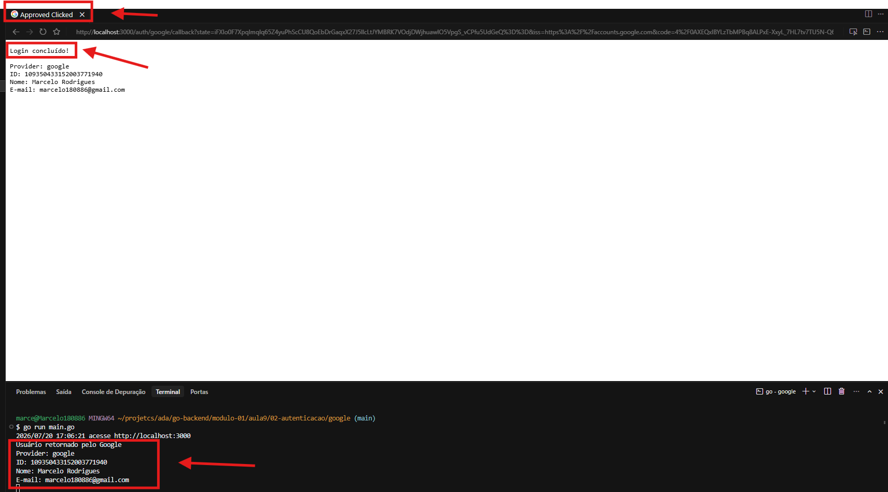

# Autenticação OAuth 2.0 com Google em Go

Este projeto demonstra a implementação de um fluxo seguro de delegação de acesso, utilizando os padrões OAuth 2.0 e OpenID Connect na linguagem Go com o pacote Goth.

## 🚀 Como funciona o fluxo

Abaixo está o registro passo a passo da configuração e execução do projeto.

### 1. A Interface e a Proteção Inicial
A aplicação possui uma página inicial com o acionador do fluxo de login. Como medida de segurança, qualquer tentativa de login sem as chaves corretas configuradas no ambiente é imediatamente bloqueada pelo Google com o erro `401: invalid_client`.

---

### 2. Configuração do Provedor de Identidade (IdP)
Para habilitar a autenticação, a aplicação foi registrada no Google Cloud Console:
* Foi gerada uma nova credencial selecionando a opção **ID do cliente OAuth**.
* O projeto foi categorizado como um **Aplicativo da Web**.
* A segurança do redirecionamento foi garantida registrando a rota exata de callback da aplicação (`http://localhost:3000/auth/google/callback`) nas URIs autorizadas.

---

### 3. Integração de Credenciais
O processo de registro gera um **ID do cliente** e uma **Chave secreta do cliente**. Esses dados são mantidos em segurança no arquivo `.env` da aplicação e injetados no momento da execução para autenticar a nossa API com os servidores do Google.

---

### 4. A Experiência do Usuário (Consentimento)
Com o ambiente configurado, o acionamento do login redireciona o usuário para o ambiente seguro do Google:
* O usuário escolhe qual conta deseja utilizar.
* A tela de consentimento do OAuth é exibida, deixando transparente para o usuário quais escopos de dados (como informações pessoais e e-mail) o aplicativo `app_teste` está solicitando acesso.

---

### 5. Conclusão e Captura de Dados
Ao permitir o acesso, o Google retorna o fluxo para a nossa aplicação junto com o código de autorização. O backend Go troca esse código pelo perfil do usuário, exibindo os dados de identidade com sucesso na tela e nos logs do servidor.

---
### Projeto criado para fins de estudo e desenvolvomento.